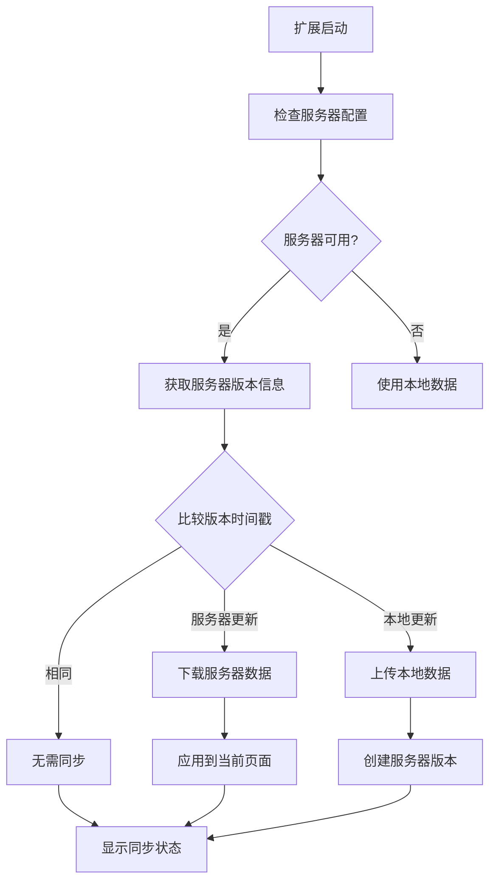
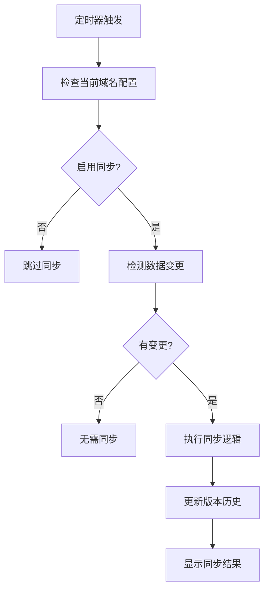

# 🎯 Cookie Manager 同步功能需求整理

## 📋 核心功能列表

### 1. 服务器配置管理
- ✅ 服务器URL配置
- ✅ 对称加密密钥设置（全局）
- ✅ 服务器连接测试
- ✅ 加密开关控制

### 2. 域名级别同步配置
- ✅ 按域名独立配置同步开关
- ✅ Cookie同步开关
- ✅ LocalStorage同步开关
- ✅ 同步间隔设置（5-60分钟）

### 3. 版本管理系统
```javascript
// 版本管理规则
const versionRules = {
    maxVersions: 5,           // 最多保存5个版本
    serverVersions: 2,        // 强制保留2个服务器版本
    localVersions: 3,         // 最多3个本地版本
    autoCleanup: true         // 自动清理旧版本
};
```

### 4. 智能同步策略
```javascript
// 同步决策逻辑
const syncDecision = {
    onExtensionStart: 'checkServer',     // 启动时检查服务器
    conflictResolution: 'newerWins',     // 新版本优先
    changeDetection: 'hashComparison',   // 基于哈希的变更检测
    autoSync: true,                      // 自动同步
    manualOverride: true                 // 支持手动操作
};
```

### 5. 数据安全
- ✅ 客户端对称加密
- ✅ 数据完整性校验（SHA-256）
- ✅ 可选的服务器端解密
- ✅ 敏感数据过滤

### 6. 用户界面
- ✅ 同步状态显示
- ✅ 数据来源标识（本地/服务器）
- ✅ 最后同步时间
- ✅ 版本历史查看
- ✅ 手动同步控制

## 🔄 同步工作流程

### 启动时同步流程


### 定时同步流程


## 📊 数据结构设计

### 同步配置
```javascript
const syncConfig = {
    server: {
        url: 'https://api.example.com',
        encryptionKey: 'user-generated-key',
        enableEncryption: true,
        timeout: 10000
    },
    domains: {
        'example.com': {
            enableCookieSync: true,
            enableStorageSync: true,
            syncInterval: 5,
            lastSyncTime: '2024-12-14T10:00:00Z',
            dataSource: 'server' // 'local' | 'server'
        }
    },
    general: {
        autoSync: true,
        maxVersions: 5,
        minServerVersions: 2
    }
};
```

### 版本快照
```javascript
const versionSnapshot = {
    id: 'uuid-v4',
    domain: 'example.com',
    timestamp: '2024-12-14T10:00:00Z',
    source: 'local', // 'local' | 'server'
    data: {
        cookies: { 'name': 'value' },
        localStorage: { 'key': 'value' }
    },
    metadata: {
        encrypted: true,
        hash: 'sha256-hash',
        size: 1024,
        changeCount: 5
    }
};
```

## 🎨 UI/UX 设计要点

### 状态指示器
```javascript
const statusIndicators = {
    connected: { color: 'green', text: '已连接服务器' },
    disconnected: { color: 'red', text: '服务器离线' },
    syncing: { color: 'blue', text: '同步中...' },
    conflict: { color: 'orange', text: '存在冲突' },
    error: { color: 'red', text: '同步失败' }
};
```

### 数据来源标识
- 🌐 服务器数据（绿色图标）
- 💻 本地数据（蓝色图标）
- ⚠️ 冲突状态（橙色图标）
- ❌ 同步失败（红色图标）

## 🚀 实施优先级

### Phase 1: 基础功能 (2-3周)
1. 服务器配置管理
2. 基础同步逻辑
3. 简单加密实现
4. 基础UI界面

### Phase 2: 增强功能 (3-4周)
1. 版本管理系统
2. 冲突检测和解决
3. 自动同步机制
4. 状态指示优化

### Phase 3: 高级功能 (4-6周)
1. 管理后台开发
2. 高级加密选项
3. 性能优化
4. 监控和日志

## ⚠️ 关键风险点

### 技术风险
- 数据同步冲突处理复杂
- 加密密钥管理安全性
- 网络异常处理

### 用户体验风险
- 配置过于复杂
- 同步状态不清晰
- 数据丢失风险

### 业务风险
- 服务器维护成本
- 法律合规要求
- 用户隐私保护

## 💡 优化建议

### 简化用户体验
1. 提供预设配置模式
2. 智能默认设置
3. 引导式初始化
4. 一键同步功能

### 提升可靠性
1. 离线模式支持
2. 数据备份机制
3. 错误恢复策略
4. 渐进式同步

### 增强安全性
1. 端到端加密
2. 访问控制
3. 审计日志
4. 数据脱敏

这个功能设计既保持了你原始需求的核心价值，又通过合理的简化和优化，提高了实现的可行性和用户体验。